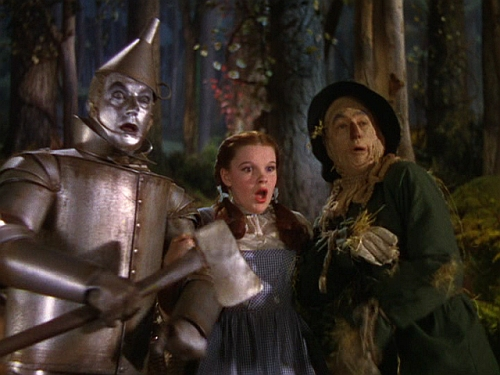

# Tech Stack Notes: AI Tools Landscape

This repository contains working notes for an orientation level brown bag talk on the AI coding tools.

## Cursor, and codex, and claude code ... oh my!

Are you finding it hard to keep up with all the developments in AI coding? It seems like every month there is a new tool. Well, this Thursday (4/2) is your chance to eat some lunch and catch up on the latest developments. (Yes it will obsolete before you graduate, but practicing keeping up is going to be a key skill going forward 🙂).

  

## Picking up from where we left off
Two years ago...
* Ask chatGPT a question and copy and past the answer into your code

A year ago...
1. Code to Code
2. Comment to Code
3. Chat to Code

and

"Claude code ... agentic coding tool" ~anthtopic

Today we are going to talk about the progress to the current paradigm of ***Agentic coding***.

## Companies and Toools

| Tool | Company | Category | Release Quarter | Popularity |
|------|---------|----------|-----------------|------------|

## Steps from Chat Copy Pasta to Integrated AI Environment to Agentic

# Plan mode

# Cowork vs. claude code

# Skills and MD profiles/configuration/rules
(The-Complete-Guide-to-Building-Skill-for-Claude.pdf)[https://resources.anthropic.com/hubfs/The-Complete-Guide-to-Building-Skill-for-Claude.pdf]

### quick notes
What do you wish you didn't have to do / end of the day low energy brain tasks 
Requires your expertise and judgement and review, but is repetitive the .... Codify and scale
It has to do the repetative stuff - not the top of the job description
Human in the loop - trust but verify - tests

# 3 iron permissions of agentic coding
3 pieces
Execute code
Communicate with outside
File access

# Homework ... where do we go from here

Homework
Pick a workflow (repetative, draining)
Write out the steps
Determine the 80% that's routine
The 20% that requires judgement
Build the system

Eg for me - publication quality plots
Paper
Screen
Projection
80% standard
Then I interested the last 20%

